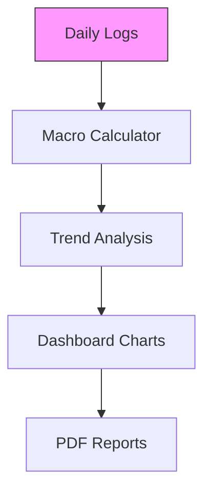

## Overview

Snacko empowers you to build smarter eating habits with personalized nutrition plans backed by behavior science. Whether you're a dietitian managing clients or tracking personally, the platform simplifies diet creation, intake logging, progress monitoring, and goal achievement. Key tools include intuitive plan builders, seamless daily tracking, insightful reports, and habit-forming features.

<Columns cols={2}>
  <Card title="Personalized Plans" icon="book-open" href="#personalized-plans">
    Create tailored diet plans for clients or yourself.
  </Card>
  <Card title="Daily Tracking" icon="zap" href="#daily-tracking">
    Log meals effortlessly with smart suggestions.
  </Card>
  <Card title="Progress Reports" icon="bar-chart" href="#progress-reports">
    Visualize achievements with customizable dashboards.
  </Card>
  <Card title="Goal Tools" icon="target" href="#goal-tools">
    Set habits and track long-term success.
  </Card>
</Columns>

## Personalized Diet Plan Creation

Build customized diet plans that adapt to individual needs, goals, and preferences. As a dietitian, assign plans to clients with restrictions like allergies or calorie targets. Personal users access pre-built templates or create from scratch.

<Steps>
  <Step title="Select Client or Profile" icon="users">
    Choose from your client list or personal dashboard.
  </Step>
  <Step title="Define Goals and Restrictions">
    Input targets such as weight loss, muscle gain, or vegan preferences.

````javascript
// Example API call to create a plan
const createPlan = async () => {
  const response = await fetch('https://api.example.com/v1/plans', {
    method: 'POST',
    headers: { 'Authorization': `Bearer ${YOUR_API_KEY}` },
    body: JSON.stringify({
      clientId: 'client-123',
      calories: 2000,
      restrictions: ['nuts', 'dairy']
    })
  });
  return response.json();
};
````

  </Step>
  <Step title="Generate and Assign" icon="check-circle">
    Review AI-suggested meals and share the plan.
  </Step>
</Steps>

<Callout kind="tip">
  Use behavior science prompts to encourage adherence, like pairing habits with daily routines.
</Callout>

## Daily Intake Tracking and Logging

Log meals, snacks, and water intake in seconds. Snacko uses photo recognition and voice input for effortless entry, calculating macros automatically.

<Tabs>
  <Tab title="Dietitian View" icon="users">
    Monitor client logs in real-time.

    <CodeGroup tabs="JavaScript,Python">
````javascript
// Fetch daily logs
const logs = await fetch('https://api.example.com/v1/logs?clientId=client-123&date=2024-10-15');
````
````python
# Fetch daily logs
import requests
logs = requests.get('https://api.example.com/v1/logs', params={
    'clientId': 'client-123',
    'date': '2024-10-15'
}).json()
````
    </CodeGroup>
  </Tab>
  <Tab title="Personal Use" icon="user">
    Quick-scan barcodes or search your food database.
  </Tab>
</Tabs>

## Progress Visualization and Reports

Gain insights with interactive charts showing weight trends, macro adherence, and habit streaks. Generate shareable PDF reports for clients.



Customize views by timeframe or metric for motivational feedback.

## Goal Setting and Habit-Building Tools

Set SMART goals like "Eat veggies daily" and track with reminders. Behavior nudges, like streak rewards, reinforce positive changes.

<Expandable title="Advanced Habit Integration" default-open="false">
  Integrate with wearables for automatic activity logging.

  <ParamField path="goals" param-type="object" required="true">
    Array of goal objects with `target`, `metric`, and `deadline`.
  </ParamField>

  Example:

````json
{
  "goals": [
    {
      "target": "5 veggie servings",
      "metric": "daily",
      "deadline": "2024-12-31"
    }
  ]
}
````
</Expandable>

<Callout kind="success">
  Clients following personalized plans see 30% better adherence rates.
</Callout>