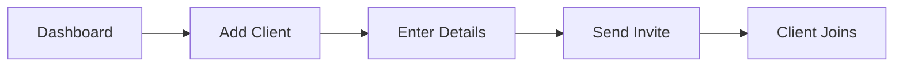

## Overview

As a dietitian on Snacko, you streamline client management by adding users, assigning personalized diet plans, tracking adherence, and generating actionable insights. The platform combines intuitive UI tools with optional API integrations for seamless workflows.

<Callout kind="info">
  Ensure you have a verified dietitian account before managing clients. Upgrade to Pro for unlimited clients and advanced reporting.
</Callout>

<Columns cols={3}>
  <Card title="Add Clients" icon="users" href="#adding-clients">
    Invite clients in seconds.
  </Card>
  <Card title="Assign Plans" icon="clipboard-list" href="#assigning-plans">
    Customize diets easily.
  </Card>
  <Card title="Track Progress" icon="trending-up" href="#tracking-progress">
    Monitor adherence live.
  </Card>
</Columns>

## Adding and Inviting Clients

Start by navigating to the Clients dashboard at `https://app.snacko.com/clients`.

<Steps>
  <Step title="Access Clients Page" icon="users">
    Log in to your dietitian dashboard and click **Clients** in the sidebar.
  </Step>
  <Step title="Add New Client" icon="plus">
    Click **Add Client** and enter details like name, email, and goals.
  </Step>
  <Step title="Send Invitation" icon="mail">
    Review profile and send the invite email. Clients activate in under 2 minutes.
  </Step>
</Steps>

Clients receive a secure link to join your practice.



## Creating and Assigning Diet Plans

Tailor plans using Snacko's library or build custom ones.

<Tabs>
  <Tab title="Pre-built Plans" icon="library">
    <Steps>
      <Step title="Select Template">
        Choose from Keto, Vegan, or Weight Loss templates.
      </Step>
      <Step title="Customize">
        Adjust calories and macros.
      </Step>
    </Steps>
  </Tab>
  <Tab title="Custom Plans" icon="edit-3">
    Create from scratch:
    
    | Meal Type | Calories | Macros |
    |-----------|----------|--------|
    | Breakfast | 400     | 20g P, 50g C |
    | Lunch     | 500     | 30g P, 60g C |
    | Dinner    | 600     | 40g P, 40g C |
    
    Assign via the client's profile.
  </Tab>
</Tabs>

<ParamField path="clientId" param-type="string" required="true">
  Unique client identifier from the invite.
</ParamField>

<ParamField body="dietPlan" param-type="object" required="true">
  JSON object with meals, goals, and duration.
</ParamField>

## Tracking Client Adherence and Updates

Monitor daily logs in real-time.

<Expandable title="View Adherence Dashboard" default-open="true">
  Access via **Clients > {clientName} > Progress**.
  
  Key metrics:
  - Completion rate (`>80%` optimal)
  - Calorie variance (`<10%`)
  - Custom notes
  
  Set alerts for missed logs.
</Expandable>

Use the API for automated checks:

<CodeGroup tabs="JavaScript,Python">
  ```javascript
  const snacko = require('snacko-sdk');
  
  const client = await snacko.clients.get('client_123');
  const adherence = await client.getAdherence({ days: 7 });
  console.log(adherence.rate); // e.g., 0.92
  ```
  ```python
  import snacko
  
  client = snacko.Client('client_123')
  adherence = client.get_adherence(days=7)
  print(adherence.rate)  # e.g., 0.92
  ```
</CodeGroup>

## Generating Client Reports and Insights

Export insights for consultations.

<Steps>
  <Step title="Select Client" icon="file-text">
    Go to client profile > **Reports**.
  </Step>
  <Step title="Choose Period" icon="calendar">
    Pick weekly, monthly, or custom range.
  </Step>
  <Step title="Generate & Share" icon="download">
    Download PDF or share secure link.
  </Step>
</Steps>

<Callout kind="tip">
  Schedule automated weekly reports in Settings > Notifications for proactive client engagement.
</Callout>

<ExpandableGroup>
  <Expandable title="Common Metrics Explained">
    - **Adherence Score**: Percentage of planned meals logged (`>90%` = excellent).
    - **Goal Progress**: Weight/body metrics vs. targets.
  </Expandable>
  <Expandable title="Troubleshooting Low Adherence">
    Review logs for patterns and adjust plans dynamically.
  </Expandable>
</ExpandableGroup>